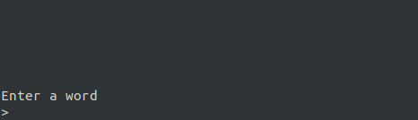

# purescript-marionette

`marionette` is a small PureScript only MVC library for writing CLI programs. 

## Installation

```
spago install marionette
```

## Getting started

In the simplest form a `marionette` program can look like this:

```hs
type State = Int

data Msg = CountUp | CountDown

update :: Msg -> State -> State
update msg state = case msg of
  CountUp -> state + 1
  CountDown -> state - 1

view :: State -> CliSurface Msg
view count = CliSurface
  ( TextOutput $
      "Current count: " <> show count
  )
  ( KeyInput (KeyPrompt "Use up/down keys") case _ of
      { name: "up" } -> Just CountUp
      { name: "down" } -> Just CountDown
      _ -> Nothing
  )

initialState :: State
initialState = 0
```

It's a counter that runs in the terminal, the user can count up and down by using the arrow keys. Check out the full code in the `examples` folder.


## Examples

### PureCounter

[Source](https://github.com/thought2/purescript-marionette/blob/main/test/Examples/PureCounter.purs)

```
spago run --main Test.Examples.PureCounter
```


### CountDown

[Source](https://github.com/thought2/purescript-marionette/blob/main/test/Examples/CountDown.purs)

```
spago run --main Test.Examples.CountDown
```


### WordTicker

[Source](https://github.com/thought2/purescript-marionette/blob/main/test/Examples/WordTicker.purs)

```
spago run --main Test.Examples.WordTicker
```




### Snake

The snake implementation can be found in [this repo](https://github.com/thought2/purescript-marionette.snake-demo).


## Prior work

- [brick](https://hackage.haskell.org/package/brick)
  A declarative Unix terminal UI library written in Haskell
- [ink](https://github.com/vadimdemedes/ink)
  React for interactive command-line apps
  
